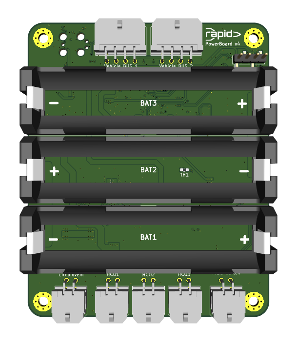

# Power Board

The battery board in our rockets.

### Components

- 3x 3000 mA h Sony VTC6 18650 lithium-ion cells in series

### Usage

| Connector           | Purpose                                                         |
| -----------         | --------------------------------------------------------------- |
| main switch         | + and - needs to be connected to enable the output on HC1, 2, 3 |
| HC1, 2, 3           | Power output                                                    |
| circumvent          | short + and - to supply power to Vmain without batteries directly from charge voltage |
| Vehicle Bus 1, 2    | Communication and bus power supply                              |

